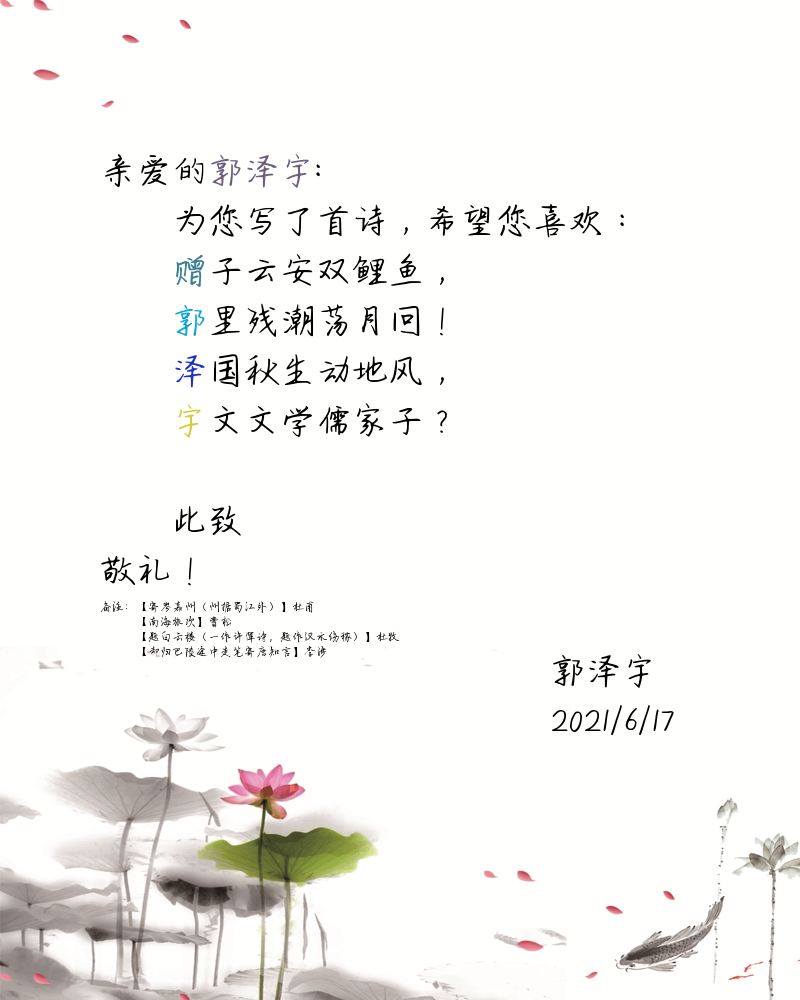
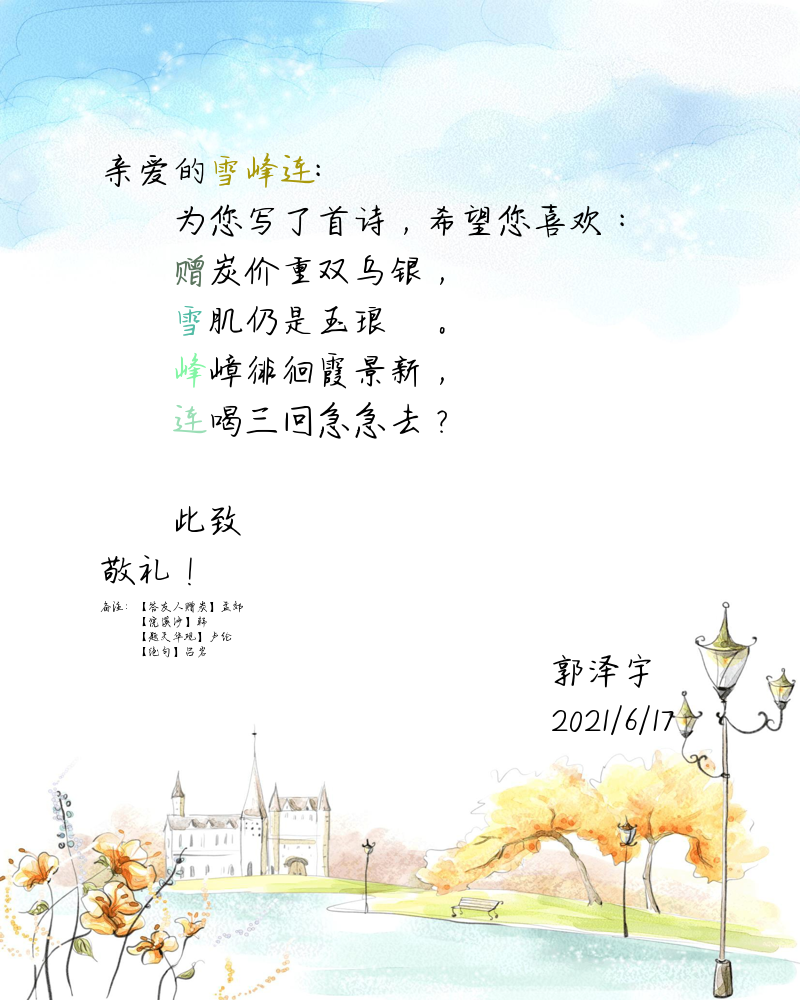

# 设计思路：

利用字典存放每个人对应的诗句和诗名，用pillow库构建图片，

# 实现方案

首先利用`.csv`文件存储人名，根据.csv文件中的项构建空字典。读入《全唐诗》的`.txt`文件，根据正则表达式找出人名中的每个字的诗句，同时将其诗名与这句诗组成一个list。再将这些list组成一个list。使用`random`函数从每个字的list中抽取一句作为诗句。将其存入之前的空字典中。这样，在这个字典中，.csv文件中的每一项对应字典的一个key，一个key对应的一个list，存放的是4个list，分别对应“赠”以及人名的三个字的诗句和诗名。

之后使用`pillow`库构建图片。事先从晚上下好5张图片作为背景，利用`random`函数挑选其中一张作为一张卡片的背景。利用`pillow`的`resize`调整大小，用`pillow.ImageDraw`库生成对应文字最终保存。

# 关键代码说明

## 构建字典部分

```python
f = csv.reader(open('name.csv'))    # 读入csv文件
names = []
for item in f:
    names.append(item[0])   # 将文件中的每一项加入list中

f = open('tangshi.txt', 'r', encoding='utf-8')  # 读入txt文件
lines = f.readlines()
f.close()

names_dict = {}
for name in names:
    name = '赠'+name    # 构建诗名
    content = []
    which_poem = []
    for i in range(4):
        estring = name[i]+'[^，。（）！？《》：；””]{6}[，。！？]'  # 构建诗句的正则表达式
        e1 = re.compile(estring)
        estring = '【[^】]*】'  # 构建诗名的正则表达式
        e2 = re.compile(estring)
        poem_name = ""
        find_result = []
        # 根据正则表达式寻找结果并加入list
        for line in lines:
            line = line.replace(u'\u3000', u' ')
            if(e2.findall(line) != []):
                poem_name = line[line.find('【'):line.rfind("\\")]
            if(e1.findall(line) != []):
                result = [poem_name, e1.findall(line)[0]]
                find_result.append(result)
        result = random.choice(find_result) # 利用random函数挑选结果
        # 重构标点符号
        if i % 2 == 0:
            result[1] = result[1][0:7]+'，'
        else:
            temp = random.randint(0, 2)
            biaodian = ['。', '？', '！']
            result[1] = result[1][0:7]+biaodian[temp]
        content.append(result)
    names_dict[name] = content  # 最终加入字典
```

## 构建图片部分

```python
for name in names_dict:
    num=random.randint(1,5) # 使用random函数挑选背景图片
    img = Image.open('background/'+str(num)+'.png')
    img=img.resize((800,1000))  # 使用resize函数调整背景图片大小
    draw = ImageDraw.Draw(img)
    font = ImageFont.truetype(font='JiangPanJiuShiYue-2.ttf', size=36)

    # 信头部分
    draw.text(xy=(100,150),text="亲爱的",fill=(0,0,0),font=font)
    draw.text(xy=(208,150),text=name[1:],fill=(random.randint(0,255),random.randint(0,255),random.randint(0,255)),font=font)
    draw.text(xy=(300,150),text="：",fill=(0,0,0),font=font)
    draw.text(xy=(172,200),text="为您写了首诗，希望您喜欢：",fill=(0,0,0),font=font)

    # 诗的部分
    i=0
    for si in names_dict[name]:
        draw.text(xy=(172,250+i*50),text=si[1][0],fill=(random.randint(0,255),random.randint(0,255),random.randint(0,255)),font=font)
        draw.text(xy=(208, 250+i*50), text=si[1][1:], fill=(0, 0, 0), font=font)
        i=i+1
    
    # 信尾部分
    draw.text(xy=(172,500),text="此致",fill=(0,0,0),font=font)
    draw.text(xy=(100,550),text="敬礼！",fill=(0,0,0),font=font)
    draw.text(xy=(550,650),text="郭泽宇",fill=(0,0,0),font=font)
    draw.text(xy=(550,700),text="2021/6/17",fill=(0,0,0),font=font)

    # 备注部分
    font = ImageFont.truetype(font='MoRanXingKai-2.ttf', size=12)
    draw.text(xy=(100,600),text="备注：",fill=(0,0,0),font=font)
    i=0
    for si in names_dict[name]:
        draw.text(xy=(136, 600+i*15), text=si[0], fill=(0, 0, 0), font=font)
        i=i+1

    # 保存图片
    file_path="card/"+name+".png"
    img.save(file_path)
```

# 效果展示





# 心得体会

本次作业考察的主要是我们对课堂上讲过的正则表达式以及各类容器的使用，难度并不是很大。而耗费时间最多的部分反而在于最终构建贺卡的部分。一开始我选择的是使用markdown构建贺卡之后转成pdf，遇到的困难主要有构建markdown文件时的格式（换行，背景等）以及最终将md文件转成pdf文件。而后一项始终未能解决，因此在耗费大量时间之后不得不重新更换成使用pillow库构建图片的方式来完成本次作业。

我一开始真没想到，md文件转成pdf文件不好转，也没想到python写md会有如此多的问题。因此耗费了大量的时间。这提醒我们在完成目标前，需要对方法进行充分的了解、判断，不能盲目开做，最终只会费力不讨好。

本作业已上传至Github以及Gitee，希望各位能点个star再走 :smile:。

()